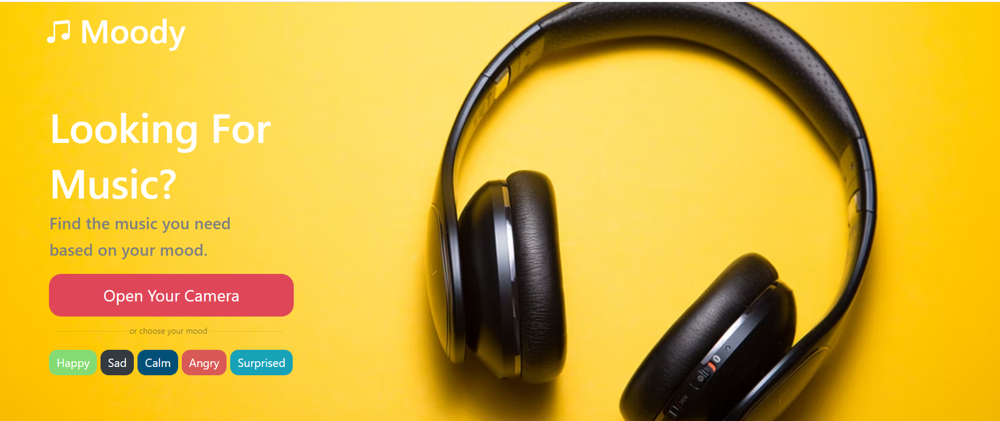
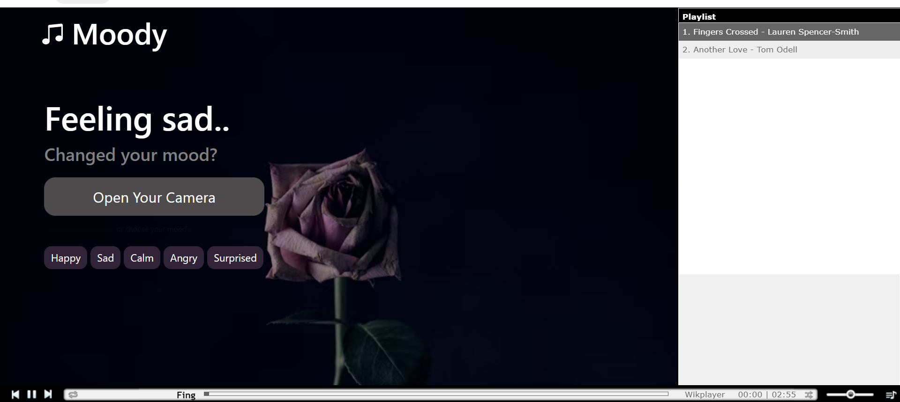
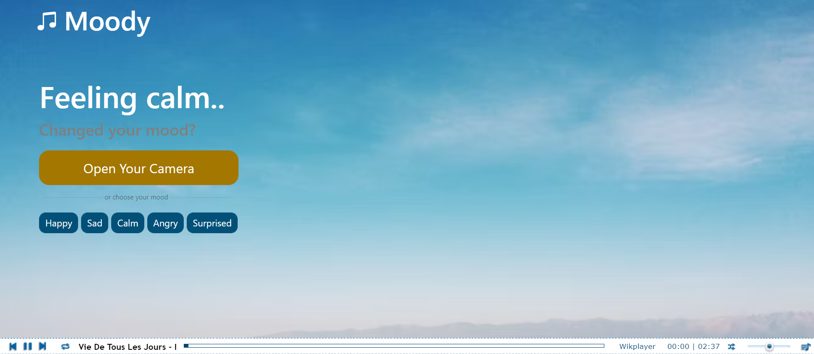
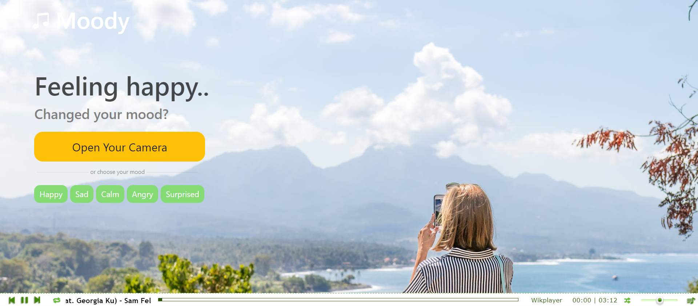
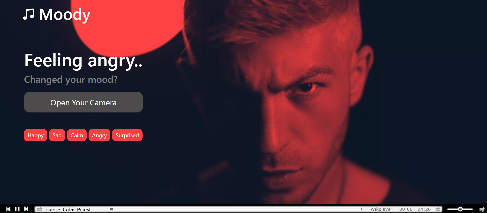
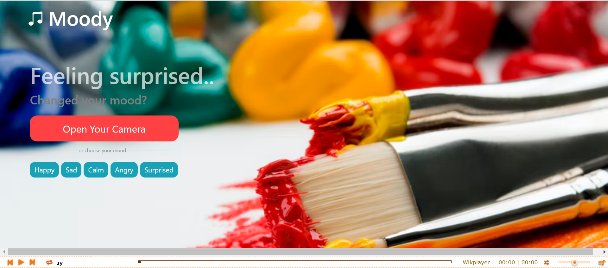

# **Moody**

- A web application that detects your mood from facial expressions and plays you music based on that.
- Uses multiple APIs (Spotify and youtube) to fetch music data. 
- Built using HTML/CSS, Node.js, Express.js, and Python.

**The home page**

**The camera:**

To take a picture so your mood can be detected.

**The moods pages** 

you get played a playlist tailored to your mood; a fun way to discover new music.

**Loading page:**

To indicate that music data is being fetched/ or that your mood is being detected from your picture.

**And that is it! Thank you for reading.**
